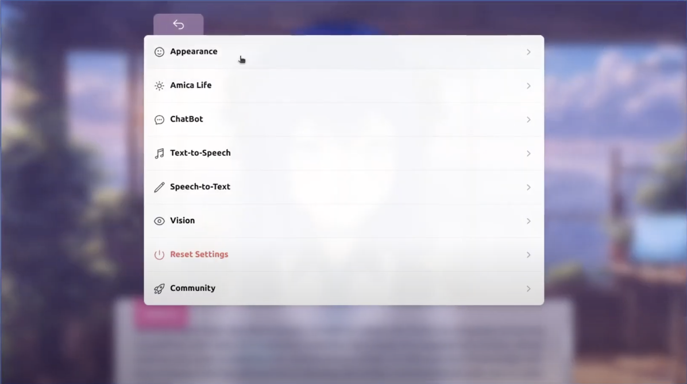


An interactive demo is available. To get started, [launch Amica](https://amica.arbius.ai).


## Quickstart

Amica is a web-based application that allows you to create and manage your own AI avatars. It is designed to be easy to use, and requires no coding experience. This guide will walk you through the process of creating your first avatar.

### Step 1 - Launch Amica

Amica is a web-based application, so there is no need to install anything. Simply [launch Amica](https://amica.arbius.ai) in your browser. We recommend using Google Chrome.

However, you may want to self-host Amica. If so, you can find the source code on [GitHub](https://github.com/semperai/amica).

Read the [Local Setup](../getting-started/installation.md) guide if you are interested in getting everything running locally quickly.

If you are using web you can start chatting immedietely by speaking into microphone or typing into the text box. (Which would use our default free server)

### Step 2 - Customize your AI

Amica comes with a default avatar (14 Emotion Expressions). You can modify this avatar by clicking on "Settings" button in the top left corner of the screen.

In the settings page, you can change everything about your avatar and AI.

If you would like to change the model:

From here, navigate to "Appearance" then to "Character Model". Here, you will be able to change the appearance of your avatar by uploading your own 3D model. You can also change the background color of the scene.

Here are some websites where you can download new avatars:

* [VRCMods](https://vrcmods.com/)
* [VRoid Hub](https://hub.vroid.com)
* [Booth](https://booth.pm)

You can also design one using [VRoid Studio](https://studio.vroid.com/).

### Step 3 - Investigate All Buttons

On the top left corner there is a vertical menu, here are all the buttons and what they do in order:

1. **Settings**: This button will open the settings page, where you can change everything about your avatar and AI.
2. **Chat History** Show your chat history, and allows save and load.
3. **Mute** Turn the speaker on and off.
4. **Camera** Upload your camera image or image file.
5. **Language** Change the language of the chatbot.
6. **Share** Share your exact avatar with others. (Including system prompt, name etc.)
7. **Import** Import your avatar from a URL sent from another community member.
8. **Brain** See your avatar's subconcious memories.
9. **Chat Toggle** Turn into a mode where you can see the entire conversation and shrink the avatar to mini-mode.
